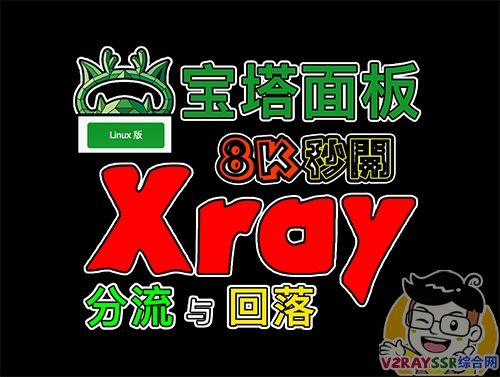
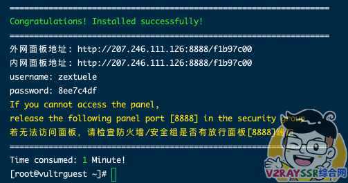
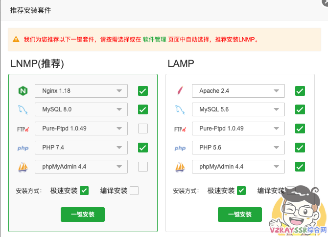
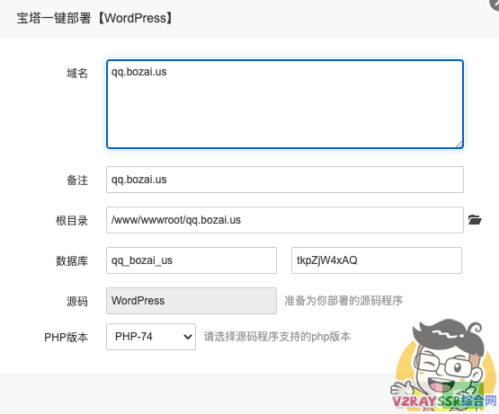
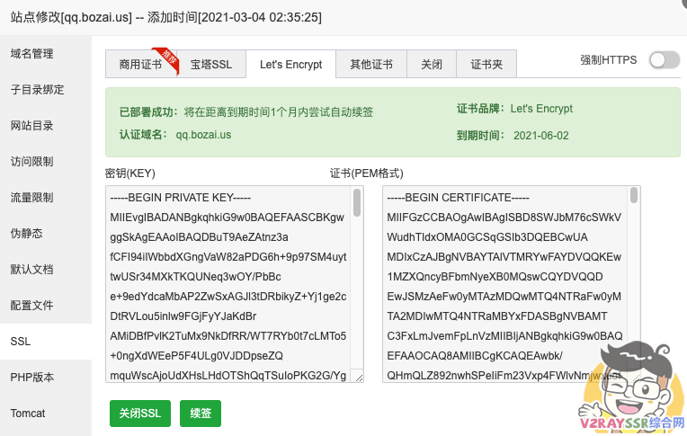
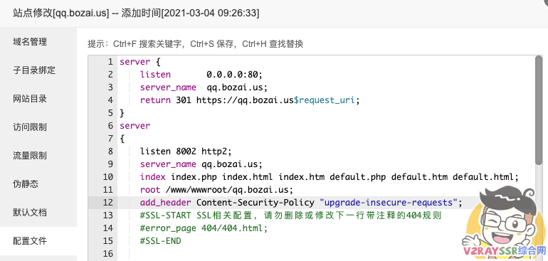
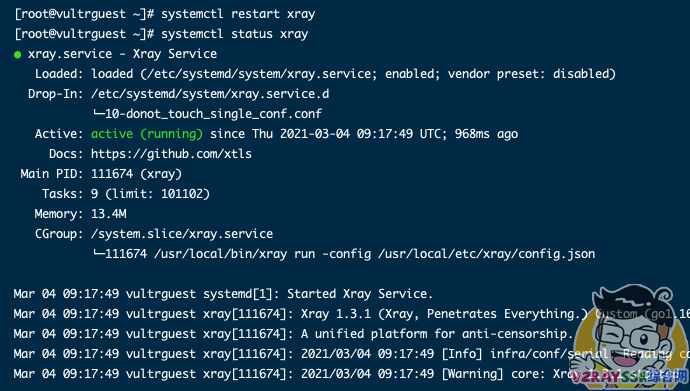
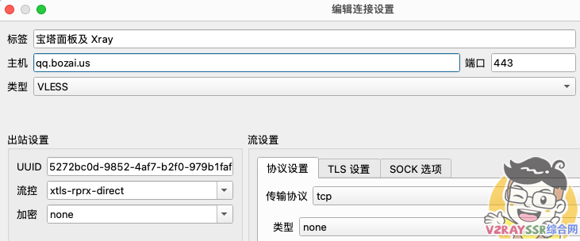
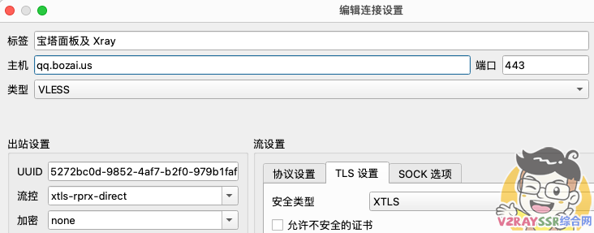

# Xray和宝塔面板共存，安装WordPress博客让你的VPS发挥最大的用途——Xray强大的回落功能

## 前言

本期视频教程，请 [点击观看](https://www.v2rayssr.com/go?url=https://youtu.be/gOOJSLICiK4)

[](https://www.v2rayssr.com/go?url=https://youtu.be/gOOJSLICiK4)

## 准备工作

1、VPS一台，内存 1G 以上，安装 CentOS7 以上的系统（ Debian 也可以，只是安装宝塔插件会很耗时）

2、域名一个托管到 Cloudflare 并解析到 VPS（不会点击：[把域名托管到 Cloudflare](https://www.v2rayssr.com/cloudflaretg.html) 不会点击：[申请域名](https://www.v2rayssr.com/yumingreg.html)）

（若是不清楚，请查看视频教程！若是以后不需要开启 CDN，可以忽略 Cloudflare）

3、自行安装 BBR 加速之类的软件，脚本 [请点击](https://www.v2rayssr.com/bbr.html)

## 开始搭建Xray+宝塔

### 更新系统并重启

```
yum update -y
reboot
```

(PS：推荐大家重启的时候 ping 一下自己的 VPS IP，看看VPS是否真的重启，有部分 VPS 提示更新完成，但是后台有部分内容导致 VPS 不能软重启，这会导致下面的搭建方式出现各种问题。一定记得！一定记得！作者是搬瓦工，必须手动进入后台硬重启)

### 安装宝塔面板

(PS:强烈推荐大家使用 CentOS 系统安装宝塔面板，其他系统也可以，相关安装命令请访问 [宝塔官网](https://www.v2rayssr.com/go?url=https://www.bt.cn))

```
yum install -y wget && wget -O install.sh http://download.bt.cn/install/install_6.0.sh && sh install.sh
```



宝塔安装完毕以后，根据自己的需求安装所需的环境插件。



运行以下代码可以解除宝塔面板的强制绑定手机

（运行完毕以后，请清除浏览器缓存并刷新宝塔面板！）

```
sed -i "s|bind_user == 'True'|bind_user == 'XXXX'|" /www/server/panel/BTPanel/static/js/index.js
```

### 部署网站

根据自己的需求，我们这边选择用WP建站。

找到软件商店——一键部署——一键部署 WordPress



部署完成以后，请自行的完成网站相关的设置。

#### 伪装网站

```
rm -rf /www/wwwroot/buffsonetwork.top/*
cd /www/wwwroot/buffsonetwork.top/
wget https://github.com/V2RaySSR/Trojan/raw/master/web.zip
unzip web.zipsystemctl 
restart nginx
```


### 安装官方 Xray 服务

以下一键安装程序来源于官方

```
bash -c "$(curl -L https://github.com/XTLS/Xray-install/raw/main/install-release.sh)" @ install -u root
```

UUID 随机生成代码

```
cat /proc/sys/kernel/random/uuid # 粘贴到VPS运行即可生成 UUID
```

e6908147-e783-498b-8ca4-4d1d19a36b19


安装完毕以后，在VPS目录 /usr/local/etc/xray 找到 config,json 文件，贴入下面的配置文件
（以下配置中，**三处** 域名处，必须修改）

```
{
    "log": {
        "loglevel": "warning"
    }, 
    "inbounds": [
        {
            "listen": "0.0.0.0", 
            "port": 443, 
            "protocol": "vless", 
            "settings": {
                "clients": [
                    {
                        "id": "你的UUID", //此处改为你的UUID
                        "level": 0, 
                        "email": "admin@gmail.com",  //此处为邮箱地址，随便修改
                        "flow":"xtls-rprx-direct"
                    }
                ], 
                "decryption": "none", 
                "fallbacks": [
                    {
                        "alpn": "h2", 
                        "dest": 8002   //此处为回落端口，若更改，请更改后面Nginx的相应配置
                    }
                ]
            }, 
            "streamSettings": {
                "network": "tcp", 
                "security": "xtls", 
                "xtlsSettings": {
                    "serverName": "qq.bozai.us",  //修改为你的域名
                    "alpn": [
                        "h2", 
                        "http/1.1"
                    ], 
                    "certificates": [
                        {
                            "certificateFile": "/www/server/panel/vhost/cert/qq.bozai.us/fullchain.pem", //修改为你的域名
                            "keyFile": "/www/server/panel/vhost/cert/qq.bozai.us/privkey.pem" //修改为你的域名
                        }
                    ]
                }
            }
        }
    ], 
    "outbounds": [
        {
            "protocol": "freedom", 
            "settings": { }
        }
    ]
}
```

### 为域名申请证书

找到网站设置界面，点击SSL为网站申请证书



（ **PS：不要开启 强制HTTPS** ）

### 设置网站配置文件

找到网站设置界面，找到配置文件

首先在代码第一行插入如下代码（强制开启 HTTPS 访问）
（记得修改两处域名为你自己的域名）

```
server {    listen       0.0.0.0:80;    server_name  qq.bozai.us;    return 301 https://qq.bozai.us$request_uri;}
```

其次删除 listen 80; 这行，并修改 443 端口为 8002 （以上配置文件端口），去除 ssl 字段。

```
listen 8002 http2;
```


### 修改后正确样式

```
server {
    listen       0.0.0.0:80;
    server_name  buffsonetwork.top;
    return 301 https://buffsonetwork.top$request_uri;
}
server
{
	listen 8002 http2;
    server_name buffsonetwork.top;
    index index.php index.html index.htm default.php default.htm default.html;
    root /www/wwwroot/buffsonetwork.top;
    add_header Content-Security-Policy "upgrade-insecure-requests";
    

}


```


然后在 root /www/wwwroot/qq.bozai.us; 后面一行插入如下代码。不会请看图比对

（**PS：下面这行代码是为了解决 Xray 回落的时候引起的 WordPress 样式问题**）

```
add_header Content-Security-Policy "upgrade-insecure-requests";
```



### 测试 Xray 配置文件

分别输入下面命令，查看 Xray 是否正常运行，若是有问题，就是配置文件出错

```
systemctl restart xray
systemctl status xray
```

如下图，显示最后一行代码，代表 Xray 正常工作中。。。


## 宝塔面板及 Xray 搭建完毕

至此，所有的搭建已经完成，大家可以随心所欲的去互联网看小姐姐了。

**若是还不会，请看视频教程！** [点击观看视频教程](https://www.v2rayssr.com/go?url=https://youtu.be/gOOJSLICiK4)

客户端方面的配置，如下图：



